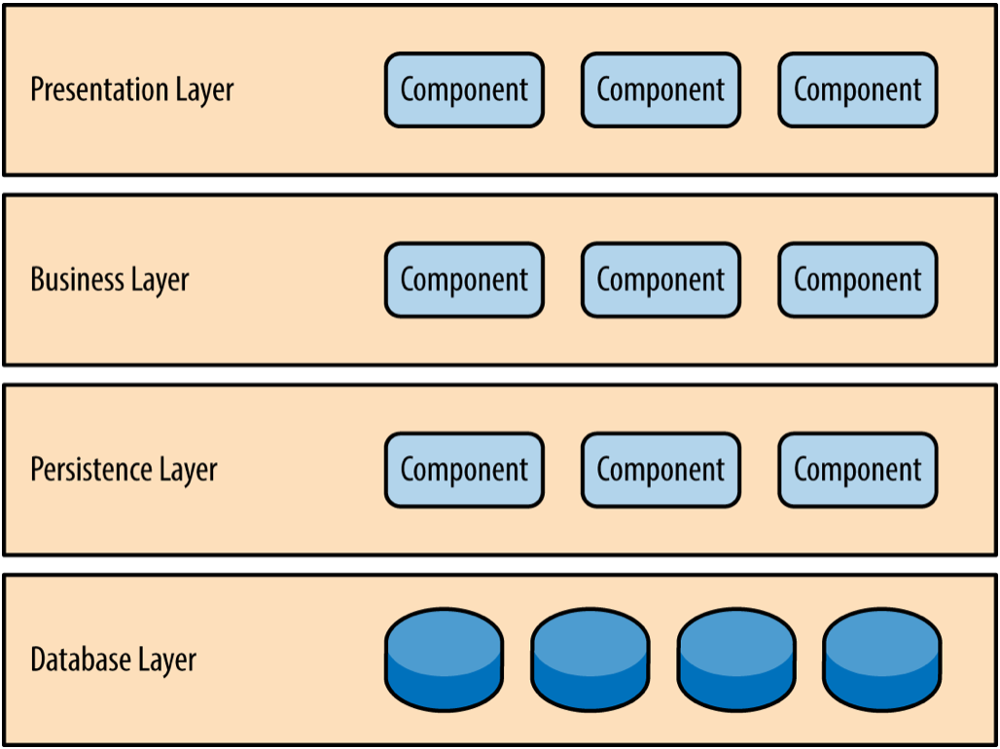

## Software Architecture Patterns

### Pattern: Layered Architecture

Layered Pattern can be used to structure programs that can be decomposed into groups of subtasks, each of which is at a particular level of abstraction. Each layer provides services to the next higher layer.
For more information about the layered architecture pattern, read the information under the Layered (n-tier) architecture in the [The top 5 software architecture patterns: How to make the right choice](https://techbeacon.com/top-5-software-architecture-patterns-how-make-right-choice) article by Peter Wayner, TeachBeacon, 2018.

Components within the layered architecture pattern are organized into horizontal layers, each layer performing a specific role within the application.

Although the layered architecture pattern does not specify the number and types of layers that must exist in the pattern, most layered architectures consist of four standard layers: presentation, business, persistence, and database.

---

## Pattern: MVC

### Model View Controller pattern

The four Agile Manifesto values are to be used as a high level starting point to drive the Agile process. An important thing to note with the Agile Manifesto values is that the items on the left are more valued than the items on the right. A common misconception is that the items on the right have zero or no value. This is not correct - the items on the right are valuable, we just value the items on the left more.happiness, usage by company size and salary range, show of interest, ease of use, and reach.

Model View Controller pattern, also known as MVC pattern, divides an interactive application in to three parts:

- **MODEL** - the core functionality and data
- **VIEW** - the information to the user (more than one view may be defined)
- **CONTROLLER** - the input from the user

This is done to separate internal representations of information from the ways information is presented to, and accepted from, the user. It decouples components and allows efficient code reuse.

---

## Pattern: Event-Driven Architecture

**Event-driven architecture (EDA)** is a software architecture pattern promoting the production, detection, consumption of, and reaction to events.
An event can be defined as "a significant change in state". For example, when a consumer purchases a car, the car's state changes from "for sale" to "sold". A car dealer's system architecture may treat this state change as an event whose occurrence can be made known to other applications within the architecture. From a formal perspective, what is produced, published, propagated, detected or consumed is a message called the event notification, and not the event itself, which is the state change that triggered the message emission.

- For more information about the event-driven architecture pattern, read:
  [The top 5 software architecture patterns: How to make the right choice](https://techbeacon.com/top-5-software-architecture-patterns-how-make-right-choice) article by Peter Wayner, TeachBeacon, 2018 under the Event-driven architecture
- Architectural Patterns by Harihara Subramanian, Pethuru Raj and Anupama Raman.
  [Event-driven architecture (EDA) and The major issues with EDA](https://www.safaribooksonline.com/library/view/architectural-patterns/9781787287495/49e85f72-0a1c-43cd-b29f-07776db94940.xhtml) specidfically.

## Pattern: Service-Oriented Architecture

**Service-Oriented Architecture (SOA)** is an architectural style that supports service-orientation.
Service-orientation is a way of thinking in terms of services and service-based development and the outcomes of services.

#### A service:

- Is a logical representation of a repeatable business activity that has a specified outcome (e.g., check customer credit, provide weather data, consolidate drilling reports)
- Is self-contained
- May be composed of other services
- Is a “black box” to consumers of the service

For a full description of the SOA pattern, please read the following resources:

- [Service-oriented architecture (SOA)](https://www.ibm.com/support/knowledgecenter/en/SSMQ79_9.5.1/com.ibm.egl.pg.doc/topics/pegl_serv_overview.html) by www.ibm.com
- [Architectural Patterns, specifically Service-oriented architecture (SOA), Service-inspired integration (SOI) and Event-driven service-oriented architecture](https://www.safaribooksonline.com/library/view/architectural-patterns/9781787287495/7dc68824-1a2a-4d50-97cf-d0758467f847.xhtml) by Harihara Subramanian, Pethuru Raj and Anupama Raman

---

## Pattern: Microservices Architecture

#### Tom Huston provides the following definition of microservises at Smartbear.com:

Microservice architecture, or simply microservices, is a distinctive method of developing software systems that tries to focus on building single-function modules with well-defined interfaces and operations. The trend has grown popular in recent years as Enterprises look to become more Agile and move towards a DevOps and continuous testing. Microservices can help create scalable, testable software that can be delivered weekly, not yearly.

Microservices have many benefits for Agile and DevOps teams - as Martin Fowler points out, Netflix, eBay, Amazon, Twitter, PayPal, and other tech stars have all evolved from monolithic to microservices architecture. Unlike microservices, a monolith application is built as a single, autonomous unit. This make changes to the application slow as it affects the entire system.  A modification made to a small section of code might require building and deploying an entirely new version of software.  Scaling specific functions of an application, also means you have to scale the entire application.

Microservices solve these challenges of montholic systems by being as modular as possible. In the simplest form, they help build an application as a suite of small services, each running in its own process and are independently deployable. These services may be written in different languages and may use different data storage techniques. While this results in the development of systems that are scalable and flexible, it needs a dynamic makeover.

**For more information about the microservices architecture pattern, please read:**

- [Microservices](https://martinfowler.com/articles/microservices.html) by James Lewis and Martin Fowler, 2014
- [The top 5 software architecture patterns: How to make the right choice](https://techbeacon.com/top-5-software-architecture-patterns-how-make-right-choice) article by Peter Wayner, TeachBeacon, 2018 under the Microservices architecture
- [What is Microservices Architecture?](https://smartbear.com/learn/api-design/what-are-microservices/) by Tom Huston, Smartbear.com, 2018

---
